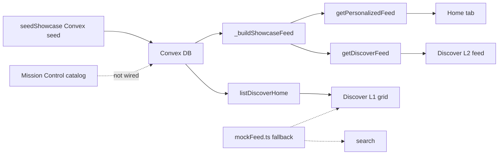
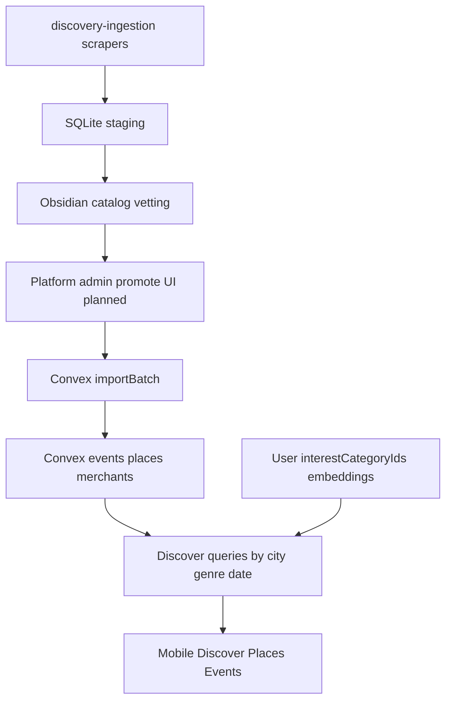

# Discover Flow Architecture Brief

**Status:** Phase 0 — architecture & catalog assessment  
**Last updated:** 2026-05-24  
**Scope:** Mobile Discover tab, Convex backend, discovery-ingestion catalog, planned admin promotion pipeline

This document describes what Discover does today, what real data we have in the Mission Control catalog, and how Places vs Events should be redesigned before any further UI wiring. It is the source of truth for product and engineering review.

**Out of scope for Phase 0:** wiring existing mock tabs/chips, schema changes, seed updates, or `importBatch` implementation.

---

## 1. Executive summary

| Layer | Today | Target |
|-------|-------|--------|
| **Data** | Fictional CPT/JHB showcase seeded via `seedShowcase` in Convex | Vetted rows promoted from discovery catalog (~1,960 entities) |
| **Discover L1** | Single 2-column category grid; Places/Events tabs are cosmetic | Separate layouts: Places (type/preference tiles) vs Events (date/genre/venue-first) |
| **Discover L2** | Category feed from Convex; filter chips are UI-only | Real filters driven by city, genre, date, venue (events) or type + preference bias (places) |
| **City** | Hardcoded "Cape Town" in category detail | City picker drives all queries (CT, JHB, DBN, PTA) |
| **Personalization** | Embeddings on home/discover feeds when signed in | Same bias model, tuned on real catalog volume |

**Recommendation:** Do not patch the current mock tabs or filter chips. Redesign Discover after catalog promotion (Phase 1) and implement new layouts in Phase 2.

---

## 2. As-is inventory (current app + backend)

### 2.1 Surface map

| Surface | File(s) | Current behavior | Data source |
|---------|---------|------------------|-------------|
| **Home feed** | `user-business-mobile/MobileApp/src/components/home/HomeContent.tsx` | Vertical feed, 16 items | Convex action `getPersonalizedFeed` |
| **Discover L1 grid** | `user-business-mobile/MobileApp/src/app/(tabs)/discover/index.tsx` | 2-column category tiles + search entry | Convex query `listDiscoverHome` when `USE_CONVEX_DATA` (default on); fallback `DISCOVER_CATEGORIES` in `mockFeed.ts` |
| **Discover L1 Places/Events tabs** | Same file, `DISCOVER_TABS` | Tab underline only; `activeTab` does not filter tiles or call backend | Mock constant only |
| **Discover L2 feed** | `user-business-mobile/MobileApp/src/app/(tabs)/discover/[category].tsx` | Card list for one category slug from route | Convex action `getDiscoverFeed({ categorySlug })` via `useDiscoverFeed` |
| **Discover L2 filter chips** | Same file, `DISCOVER_FILTER_CATEGORIES` | Horizontal chips move underline; `activeFilter` defaults to `"All"` regardless of route | Mock constant; **does not filter or refetch** |
| **Discover search** | `discover/search.tsx` | Static results | `FEED_ITEMS` mock |
| **Library / bookmarks search** | `library/search.tsx`, `[collectionId].tsx` | Static item lookup | `FEED_ITEMS` mock |
| **La Parada demo block** | `[category].tsx` ListHeaderComponent | Product overlay preview | Convex `merchants.listProducts` (hardcoded `la-parada`) |
| **Ingestion → app** | `user-business-web/convex/ingestion/importBatch.ts` | Stub returns "Phase 2 deferred" | Not connected |

Feature flag: `USE_CONVEX_DATA` is `true` unless `EXPO_PUBLIC_USE_CONVEX_DATA=false` (`src/config/features.ts`).

### 2.2 Convex endpoints (Discover-related)

| Endpoint | Path | Role |
|----------|------|------|
| `listDiscoverHome` | `convex/platform/categories.ts` | Returns tiles where `showOnDiscoverHome === true` (slug, label, color, image URL) |
| `getPersonalizedFeed` | `convex/platform/discovery.ts` | Home feed: `composeFeed` → guest showcase mix or taste/explore bands for signed-in users with embeddings |
| `getDiscoverFeed` | `convex/platform/discovery.ts` | Category feed: same pipeline with `discoverCategorySlug` filter |
| `_buildShowcaseFeed` | `convex/platform/feed.ts` (internal query) | Builds cards from `events`, `places`, `merchants`, `products`, `posts` tables; optional category filter via `matchesDiscoverCategorySlug` |
| `getProfile` | `convex/userProfile.ts` | Used inside `composeFeed` for embedding-based personalization |

**Seed dependency:** All live Discover/Home content today comes from `seedShowcase` (`convex/seedShowcase.ts`), not from the discovery catalog. That seed defines:

- 10 discover tiles: beach-bars, cost-effective, sundowners, cafes, romantic, night-clubs, wine-bars, vegetarian, dive-bar, on-the-coast
- Fictional merchants/places/events/products (Keinemusik, La Parada, Ycago grocery, etc.)
- `discoverCategorySlugs` on entities mapped from Cape Town–style vibe labels

### 2.3 Current data flow



### 2.4 Known UI bugs (do not fix by wiring mocks)

1. **L1 Places/Events tabs** — no backend filter; Events tab still shows place-vibe tiles.
2. **L2 filter chips** — feed always uses route param `category`; chips default to `"All"` even when user tapped e.g. Sundowners on L1.
3. **City** — `[category].tsx` hardcodes location chip text `"Cape Town"`; no query arg for city.
4. **`useDiscoverFeed(undefined)`** — returns empty array; "All" unfiltered browse would need optional `categorySlug` on the action (backend already supports undefined slug in `_buildShowcaseFeed`, but action requires a string today).

### 2.5 Personalization (existing, reusable)

Signed-in users with `users.embedding` get taste/explore interleaving in `composeFeed` / `composeDiscoveryFeed` (`discovery.ts`):

- Taste pool: vector search on products, merchants, places
- Explore pool: showcase cards not in taste set
- Guest users: shuffled showcase mix via `buildGuestFeed`

Onboarding `interestCategoryIds` feed into embeddings via `userEmbeddings.recomputeForUser`. This bias model should carry into the redesigned Discover, but surface **preferred places/events first** while keeping full browse paths.

---

## 3. Discovery catalog reality check

**Location:** `C:\Users\User\Desktop\Mission Control\business\discovery-catalog`  
**Export date:** 2026-05-24  
**Staging DB:** `discovery-ingestion/data/discovery.db`  
**Vetting:** All entities `vetting_status: pending`

### 3.1 Volume by city

| City | Total | Events | Artists | Places | Deals |
|------|------:|-------:|--------:|-------:|------:|
| Cape Town | 892 | 853 | 11 | — | 28 |
| Johannesburg | 745 | 537 | 148 | 60 | — |
| Pretoria | 176 | 160 | 16 | — | — |
| Durban | 147 | 127 | 20 | — | — |
| **Total** | **~1,960** | **~1,677** | **~195** | **60** | **28** |

Events dominate (~85% of entities). Places exist only for Johannesburg (60 Google Places venues). Deals only in Cape Town (Fomosa, Hyperli).

### 3.2 Folder structure

```
discovery-catalog/
├── {city}/                          # cape-town | johannesburg | pretoria | durban
│   ├── Discovery-Catalog-{City}.md  # index + counts
│   ├── events/{provider}/{bucket}/  # bucket = YYYY-MM or unknown-date
│   ├── artists/{provider}/unknown-genre/
│   ├── places/google_places/venue/  # JHB only
│   └── deals/{provider}/            # CT only
```

**Source providers (selected):**

| Provider | Types | Cities |
|----------|-------|--------|
| quicket | events | all 4 (809 in CT alone) |
| howler | events, artists | all 4 |
| webtickets | events | CT, JHB |
| bandsintown, fever, airdosh | events, artists | JHB |
| google_places | places | JHB |
| fomosa, hyperli | deals | CT |

### 3.3 Entity metadata patterns

**Shared frontmatter (all entities):**

```yaml
entity_type: event | place | artist | deal
source_provider: howler | quicket | google_places | ...
source_external_id: ...
city_slug: cape-town | johannesburg | ...
vetting_status: pending
exported_at: ...
```

**Howler event (structured — good for genre filters):**

- Folder: `events/howler/2026-06/howler-39487.md`
- Body: ISO `When` / `Ends`, `Location`, `Ticketing` URL, **single-word `Description`** (e.g. `Music`, `Nightlife`, `Festival`)

**Quicket event (weak structure — majority of volume):**

- Folder: almost always `events/quicket/unknown-date/`
- Dates often missing or Unix epoch in body; categories only inferrable from HTML title/description

**Google Places venue (minimal taxonomy):**

- Body: `Kind: venue` only — no restaurant/bar/café subtype in export
- Example: tashas Rosebank — address, phone, website, free-text description

**Artists:** all under `unknown-genre/`; no genre field in frontmatter.

### 3.4 Representative category types in catalog

**Events (from Howler labels + title themes):**

1. Nightlife — club nights, DJ sets  
2. Festival — Ultra SA, Amapiano Fest, Afropunk  
3. Music — concerts, tributes, live performances  
4. Lifestyle — markets, picnics, wellness  
5. Sports — runs, wrestling, relay races  
6. Comedy — stand-up showcases  
7. Theatre / Performance — musicals, ballet, candlelight concerts  
8. Workshops / Masterclasses — makeup, AI literacy  
9. Worship / Conference — church services, business summits  
10. Food & Wine — winemakers dinners, high teas  

**Places (inferred from names/descriptions — not normalized in export):**

1. Restaurant — Marble, Zioux, AURUM  
2. Café / Coffee shop — tashas, Yield Coffee BAR  
3. Bar / Pub — Hogshead Illovo, Island Bar  
4. Bistro — Sadie's Bistro, Keystone Bistro  
5. Restaurant & Bar — San Deck, TANG Asian Luxury  
6. Rooftop / upscale dining — Alto234, Level Four  
7. Chain café-bar — News Cafe, Hard Rock Cafe  
8. Events venue — Milk Bar Events Venue, ARTIVIST  
9. Casual eatery / grill — Tiger's Milk, Mozambik  
10. Specialty / themed — The Whippet, Delta Cafe  

### 3.5 Gap vs current Discover UI tiles

Current `seedShowcase` tiles are **Cape Town lifestyle vibes** (beach-bars, sundowners, on-the-coast, romantic, …). They do **not** map cleanly onto catalog data:

| Current tile | Catalog fit |
|--------------|-------------|
| beach-bars, on-the-coast | Conceptual; not a field in catalog events or places |
| sundowners, romantic, wine-bars | Curated marketing buckets; places lack taxonomy to auto-assign |
| night-clubs | Partial overlap with Howler `Nightlife` events, not place types |
| cost-effective, vegetarian | Product/menu concept; catalog has deals (CT) not restaurant dietary tags |
| cafes | Weak match to Google descriptions mentioning "café" |

**Events tab expectation:** User intent is **not** the same 2-column vibe grid as Places. Events need date-first and genre-first browsing (festivals ≠ restaurant pop-up ≠ nightclub residency). Quantity and metadata differ per provider.

**Places tab expectation:** Once Google Places expands beyond JHB, tiles should reflect **place type + user preferences**, with bias toward onboarding interests—not generic event-style categories.

---

## 4. Proposed information architecture (brainstorm)

### 4.1 Design principles

1. **Places and Events are different products** — different L1 layouts, filters, and density.
2. **City is a first-class axis** — every query scoped by `citySlug`; UI city picker replaces hardcoded chip.
3. **Preference bias, not preference prison** — rank toward onboarding interests / embeddings; always expose "see all" or unfiltered browse.
4. **Catalog is source of truth** — Convex showcase seed is transitional; production data flows from vetted catalog promotion.
5. **Normalize on import** — provider quirks (Quicket dates, HTML categories) cleaned at promotion time, not in mobile UI.

### 4.2 Places tab (target UX)

**Primary filters:**

| Axis | Source | Notes |
|------|--------|-------|
| City | `city_slug` from catalog / `places.location` | CT, JHB, DBN, PTA |
| Place type | Google types → Aux buckets on import | restaurant, bar, café, venue, … |
| Preference boost | `interestCategoryIds`, user embedding | Surface "for you" row or sort bias |
| Text search | Name, description, address | Later phase |

**Layout options (L1):**

- **Option A:** Type grid (Restaurants, Bars, Cafés, Venues, …) — counts per city
- **Option B:** "For you" horizontal carousel + type grid below
- **Option C:** Map + list toggle (requires lat/lng from Google Places)

**L2 (place list for a type or "For you"):**

- Card: image, name, type chips, distance (future), open/closed (future)
- Sort: relevance (embedding), distance, newest
- No date filter (places are persistent)

**Near-term blocker:** Only 60 places (JHB). Need `google_places` scrape for CT, DBN, PTA before Places tab feels real in those cities.

### 4.3 Events tab (target UX)

**Primary filters:**

| Axis | Source | Notes |
|------|--------|-------|
| City | `city_slug` | Required |
| Date | `startTime` / Howler ISO dates | This week, this month, calendar picker; Quicket needs normalization |
| Genre / category | Howler `Description` + inferred Quicket tags | Nightlife, Festival, Music, Comedy, … |
| Venue / place | `Location` string → resolved `venuePlaceId` | Group events at same venue |
| Preference boost | Embeddings on event/merchant vectors | Optional ranking layer |

**Layout options (L1 — not a vibe tile grid):**

- **Option A (recommended):** Date-first — sections "This week", "This month", "Later" with horizontal event cards
- **Option B:** Genre chips row + date-scoped list below
- **Option C:** Venue hub — popular venues in city → events at venue

**L2 (event list for filter combo):**

- Card: image, title, date/time, venue, genre chip, external ticket link
- Filters persist in header (city, date range, genre multi-select)
- Empty states per city when provider coverage is thin (e.g. Howler 24 in CT vs Quicket 809)

**Volume note:** ~1,677 events but date metadata uneven — Howler/Fever usable; Quicket majority in `unknown-date/` needs import-time parsing or admin date entry on promote.

### 4.4 Shared chrome

| Element | Current | Target |
|---------|---------|--------|
| City picker | Hardcoded "Cape Town" | CT / JHB / DBN / PTA; persisted locally; drives all Discover queries |
| Search | Mock feed items | Convex search index over promoted entities by city |
| Preference bias | Home + discover composeFeed | Explicit "Recommended for you" sections on both tabs |
| Artists | Not in app | TBD — artist pages linked from events, or separate tab |
| Deals | Not in app | TBD — CT-only; could be Discover sub-tab or Pay/commerce |

### 4.5 Target data pipeline



**Promotion mapping (draft):**

| Catalog entity | Convex table | Key normalized fields |
|----------------|--------------|------------------------|
| event | `events` | `startTime`, `endTime`, `location`, `externalTicketingUrl`, `feedCategories`, `discoverCategorySlugs`, `venuePlaceId`, city on merchant/place |
| place | `places` | `placeKind`, `location`, `feedCategories`, `discoverCategorySlugs`, `linkedMerchantId` |
| artist | TBD | Link table to events; optional `merchants` type `event_organizer` |
| deal | TBD | `products` or separate deals table |

Stub today: `convex/ingestion/importBatch.ts` — `approvedOnly: true`, returns zero imports.

---

## 5. Backend capabilities needed (future — not built in Phase 0)

| Capability | Why | Likely touchpoints |
|------------|-----|-------------------|
| `citySlug` on discover queries | City switching | `listDiscoverHome`, `getDiscoverFeed`, `_buildShowcaseFeed`, new `listEvents` / `listPlaces` |
| Optional `categorySlug` on `getDiscoverFeed` | Unfiltered "All" browse | `discovery.ts` — `_buildShowcaseFeed` already allows undefined slug |
| `discoverTab: "places" \| "events"` on categories | L1 tab split | `schema.ts` categories table, seed/import, `listDiscoverHome` filter |
| Event filters: `startAfter`, `startBefore`, `genre`, `venuePlaceId` | Events L2 | `events` indexes on `startTime`; normalized genre field on import |
| Place filters: `placeKind`, preference boost | Places L2 | `places.by_active` + embedding search; Google type mapping on import |
| `importBatch` implementation | Admin → DB | `ingestion/importBatch.ts`, read approved rows from SQLite |
| Normalization layer | Quicket date/category cleanup | Ingestion export or import-time transforms |
| Full-text / geo search | Discover search modal | New Convex search index or external service |
| City on entities | Filter correctness | Add `citySlug` to events/places or derive from linked merchant location |

**Convex schema already has** (usable after real data):

- `events`: `startTime`, `endTime`, `venuePlaceId`, `feedCategories`, `discoverCategorySlugs`, `embedding`
- `places`: `placeKind`, `location`, `feedCategories`, `discoverCategorySlugs`, `embedding`
- `categories`: `showOnDiscoverHome`, `discoverGroup`, `slug`, `tileColor`

**Missing for catalog-driven Discover:**

- `citySlug` on events/places (or reliable join through location)
- Normalized `eventGenre` / provider source ids for dedup
- Import provenance fields (`source_provider`, `source_external_id`, `vetting_status`)

---

## 6. Recommended phasing

### Phase 0 — Now

- [x] This architecture document
- [ ] Product review of Places vs Events layouts (options in §4.2–4.3)
- [ ] Resolve open decisions (§7)

**Defer:** Wiring current `DISCOVER_TABS`, `DISCOVER_FILTER_CATEGORIES`, or mock fallbacks.

### Phase 1 — Catalog → Convex

1. Expand `google_places` scrape to CT, DBN, PTA  
2. Implement `importBatch` for vetted `approved` rows  
3. Normalize Howler genres + Quicket dates on import  
4. Seed Convex from catalog (reduce reliance on `seedShowcase` fiction)  
5. Admin MVP: list pending catalog entities, approve, promote (can start read-only in Obsidian)

### Phase 2 — Discover redesign (mobile + API)

1. City picker wired to all Discover queries  
2. Separate **Places** and **Events** L1 layouts per §4  
3. Real L2 filters (genre, date, venue for events; type + preference for places)  
4. Replace mock search with Convex search  
5. Remove or gate `mockFeed.ts` Discover dependencies

### Phase 3 — Personalization & admin polish

1. Tune taste/explore bands on real volume  
2. Full admin UI: edit before promote, duplicate detection, merchant claim (`claimMerchant` stub)  
3. Artists/deals surfaces if in scope  
4. Map view, distance sort (requires lat/lng quality)

---

## 7. Open decisions

| # | Question | Options | Recommendation |
|---|----------|---------|----------------|
| 1 | Event genre taxonomy | Howler 11 labels only vs expanded Aux taxonomy | Start with Howler labels + `Other`; map Quicket via title NLP + admin override on promote |
| 2 | Quicket `unknown-date/` majority | Infer on import vs require admin date before promote | Infer when parseable; block promote when date missing; show in admin "needs date" queue |
| 3 | Places taxonomy | Google types vs curated vibe buckets (beach-bars, sundowners) | **Google types for filter UI**; optional curated tags for marketing rows once volume exists |
| 4 | Default city | Device GPS vs last selected vs onboarding city | Last selected with GPS suggestion; fallback JHB or CT by market priority |
| 5 | Artists in Discover | Linked from events vs dedicated tab vs omit v1 | Omit dedicated tab v1; show artist chip on event detail; import artists for lineup resolution |
| 6 | Deals (CT) | Discover tab vs Pay vs home promo | Separate "Deals" entry under Discover or Pay; 28 entities too small for own tab initially |
| 7 | Events L1 layout | Date-first vs genre-first | **Date-first** given uneven genre on Quicket; genre chips as secondary filter on L2 |
| 8 | Preference bias UX | Hidden reorder vs explicit "For you" section | Explicit section + default sort bias; never hide categories user didn't select |

---

## 8. Appendix: file reference

### Mobile

| Path | Purpose |
|------|---------|
| `user-business-mobile/MobileApp/src/app/(tabs)/discover/index.tsx` | Discover L1 |
| `user-business-mobile/MobileApp/src/app/(tabs)/discover/[category].tsx` | Discover L2 |
| `user-business-mobile/MobileApp/src/app/(tabs)/discover/search.tsx` | Discover search (mock) |
| `user-business-mobile/MobileApp/src/hooks/usePersonalizedFeed.ts` | `useDiscoverFeed`, `usePersonalizedFeed` |
| `user-business-mobile/MobileApp/src/data/mockFeed.ts` | `DISCOVER_CATEGORIES`, `DISCOVER_TABS`, `DISCOVER_FILTER_CATEGORIES`, `FEED_ITEMS` |
| `user-business-mobile/MobileApp/src/config/features.ts` | `USE_CONVEX_DATA` |

### Convex

| Path | Purpose |
|------|---------|
| `user-business-web/convex/platform/categories.ts` | `listDiscoverHome` |
| `user-business-web/convex/platform/discovery.ts` | `getPersonalizedFeed`, `getDiscoverFeed`, `composeFeed` |
| `user-business-web/convex/platform/feed.ts` | `_buildShowcaseFeed`, `matchesDiscoverCategorySlug` |
| `user-business-web/convex/seedShowcase.ts` | Transitional seed data |
| `user-business-web/convex/ingestion/importBatch.ts` | Phase 2 promotion stub |

### Ingestion & catalog

| Path | Purpose |
|------|---------|
| `discovery-ingestion/` | Scrapers, SQLite, Obsidian export |
| `C:\Users\User\Desktop\Mission Control\business\discovery-catalog\` | Vetting workspace (~1,986 markdown files) |
| `discovery-ingestion/config/cities.yaml` | City definitions for scrapers |

---

## 9. What we are explicitly not doing yet

- Wiring `DISCOVER_TABS` (Places/Events) to backend filters  
- Wiring `DISCOVER_FILTER_CATEGORIES` chips to refetch  
- Adding event tiles to `seedShowcase` to fake an Events tab  
- Patching `[category].tsx` "All" chip without full redesign  
- Connecting Mission Control catalog to Convex without vetting + `importBatch`

When Phase 1 delivers real promoted data, implement Discover per §4–§6 rather than incremental fixes to the current mock structure.
