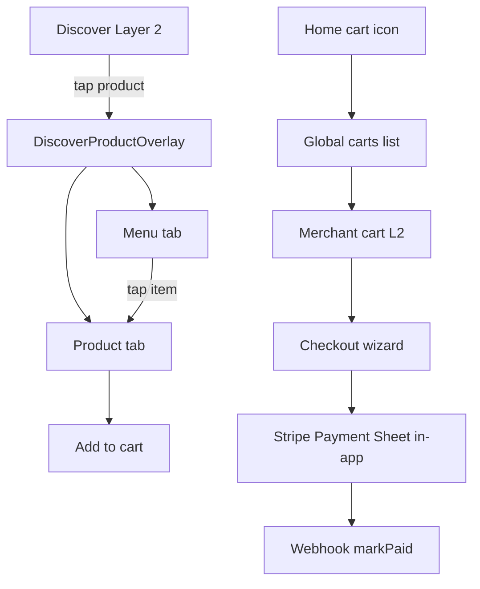

# Mobile Commerce Flow

End-to-end UX for Discover → product overlay → cart → checkout. **Database rationale:** [`domain_model_decisions.md`](domain_model_decisions.md).

---

## Flow diagram

---

## Step-by-step

| Step | Screen | Data | Success |
|------|--------|------|---------|
| 1 | Discover L2 → tap product | In-place overlay | Product tab, aspect snap |
| 1b | Menu tab → tap item | Same overlay | Switches to Product tab |
| 1c | Menu sheet drag down | Gesture | Returns to minimized Product |
| 2 | Add to cart | MMKV `cartStore` | Line under merchant |
| 3 | Home cart icon | Group by `merchantSlug` | Carts list |
| 4 | View cart L2 | Filtered store | Qty +/-, delete confirm at 0 |
| 5 | Go to checkout | `orders.createPending` | Pending order + stock reserved |
| 6 | Delivery/pickup | `users.address` | Address on user/order |
| 7 | Pay | `checkout.createPaymentIntent` + Payment Sheet | Native sheet (card / Apple Pay / Google Pay) |
| 8 | Webhook | `orders.markPaidByPaymentIntent` | Paid in admin |
| 9 | Event ticket | `startPlatformCheckout` | Ticket instance |

---

## Product overlay (aspect snap)

| `mediaAspect` | Ratio | Sheet snap |
|---------------|-------|------------|
| `square` | 1:1 | ~42% |
| `portrait45` | 4:5 | ~58% |
| `portrait34` | 3:4 | ~62% |
| `landscape` | 1.91:1 | Expanded preferred |
| `story` | 9:16 | Expanded preferred |

Seed products on La Parada (see `seedPlatform`) exercise each ratio.

---

## Payments (in-app Payment Sheet)

- **Native Payment Sheet** via `@stripe/stripe-react-native` — card, Apple Pay, and Google Pay stay in-app (no browser redirect).
- **Backend:** `checkout.createPaymentIntent` → Stripe PaymentIntent with order total + metadata.
- **Webhook:** `payment_intent.succeeded` → `orders.markPaidByPaymentIntent`.
- **Web checkout** still uses Stripe Checkout Sessions (`startStripeCheckout`) for the Next.js app.
- **Stubs (UI only):** promo codes, membership credits, wallet balance.

### Prerequisites

| Requirement | Status |
|-------------|--------|
| Expo SDK 56 + dev build | Upgraded — `@stripe/stripe-react-native` requires native rebuild (`npx expo run:android` / `run:ios`) |
| `EXPO_PUBLIC_STRIPE_PUBLISHABLE_KEY` | Set in `MobileApp/.env` |
| `EXPO_PUBLIC_CLERK_PUBLISHABLE_KEY` | Set in `MobileApp/.env` |
| `checkout.createPaymentIntent` on Convex | Deployed to `tacit-iguana-891` |
| Webhook | `payment_intent.succeeded` enabled on Convex endpoint |

**Test card:** `4242 4242 4242 4242` (any future expiry, any CVC).

**Apple Pay:** requires Apple Merchant ID `merchant.com.ng4.aux` registered in Apple Developer + Stripe Dashboard (dev build only; not Expo Go).

---

## Linear issues

NG-17 through NG-34 — all High priority. See commerce flow plan.

---

## Verification (E2E)

1. Discover → overlay → all 5 aspect products via Menu tab
2. Add to cart → carts hub → cart L2 → checkout → Stripe test card
3. Admin order visible with `orderKind: product`
4. Event ticket → `orderKind: ticket`
