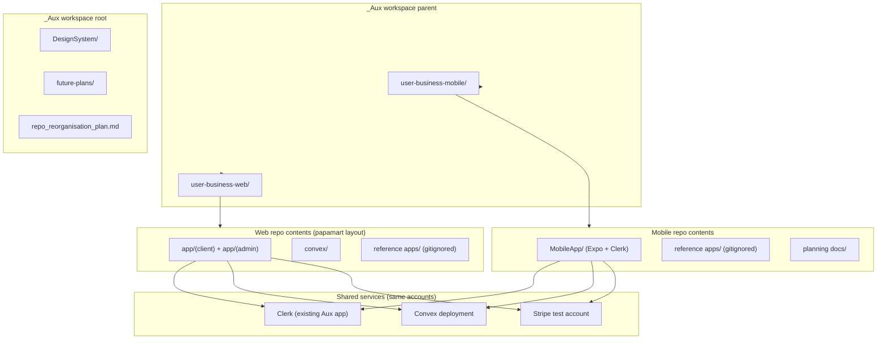

# Aux Repo Reorganisation Plan

## Corrected architecture (per your feedback)

**Do not** split the web side into `UserWebApp/` and `BusinessWebApp/` folders. Follow [papamart](C:/Users/User/Desktop/builds/papamart): one Next.js app with route groups:

- `app/(client)/` — customer storefront (browse, cart, checkout, orders)
- `app/(admin)/admin/` — business/admin dashboard (products, orders, customers)
- `convex/` — shared realtime backend at repo root
- `components/`, `lib/`, `package.json`, etc. at repo root

The names **“User & Business mobile app repo”** and **“User & Business web app repo”** refer to **two sibling folders/repos**, not to internal app splits.



---

## Target folder layout

```
_Aux/                                    # Toqo workspace parent (existing git root)
├── repo_reorganisation_plan.md          # this plan — source of truth
├── DesignSystem/                        # copied from variant/node branch (see Phase 0)
│   ├── 1-ScreenGroups.md
│   ├── 2-UI-Elements.md
│   ├── 3-Flow.md
│   └── 4-MarketingPages.md
├── future-plans/                        # long-horizon platform docs (copied, not rewritten)
│   ├── EVENT_DISCOVERY_PLATFORM_BLUEPRINT.md
│   ├── PLATFORM_SYNERGY_ANALYSIS.md
│   └── END_TO_END_SYSTEM_FLOW.md
├── user-business-mobile/                # “User & Business mobile app repo”
│   ├── MobileApp/                       # moved from current root
│   ├── reference apps/                  # gitignored UI/experiment references
│   │   ├── ai chat interface/
│   │   ├── stable date picker/
│   │   ├── onboarding apple invites style/
│   │   ├── photo gallery for menu-product items/
│   │   ├── photo gallery for places-products-events/
│   │   └── apple wallet style animations/
│   ├── planning docs/                   # active sprint/planning markdown
│   │   ├── aux_tasks_roadmap.md
│   │   ├── detailed_auth_flow_plan.md
│   │   ├── routing_update_plan.md
│   │   ├── routing_audit.md
│   │   ├── sign_in_flow_tracking.md
│   │   ├── picker_stability_audit.md
│   │   └── pr.md
│   └── .gitignore
│
└── user-business-web/                   # “User & Business web app repo”
    ├── app/                             # copied from papamart (not rewritten)
    ├── convex/
    ├── components/
    ├── lib/, hooks/, public/
    ├── package.json, next.config.ts, proxy.ts, etc.
    ├── .env.local                       # your Clerk/Convex/Stripe keys (gitignored)
    ├── reference apps/                  # gitignored upstream/future-schema references
    │   ├── papamart/
    │   └── ticket-marketplace-saas-nextjs15-convex-clerk-stripe-connect/
    ├── .agents/skills/                # all 16 papamart agent skills (copied with project)
    ├── AGENTS.md                        # Convex + Stripe Projects CLI agent instructions
    └── .gitignore
```

**Workspace-root docs:**
- **`DesignSystem/`** — product UI catalogue for Toqo; source is [`C:\_Aux\.github\instructions\DesignSystem`](C:/_Aux/.github/instructions/DesignSystem) on the `variant/node` branch (4 markdown files: screen groups, UI elements, flows, marketing pages). Lives at workspace root so both mobile and web repos can reference it.
- **`future-plans/`** — strategic docs copied from ForgeBackend; referenced in Phase 6 and Linear backlog, not implemented in this sprint.

**Explicitly excluded:** `API/`, `MasterPortal/`, Node+Drizzle backend — superseded by Convex-as-BaaS. Future ad-processing backend per `future-plans/EVENT_DISCOVERY_PLATFORM_BLUEPRINT.md` is out of scope for Phases 0–5.

Folder names are flexible (`user-business-mobile` / `user-business-web` are suggested slugs); semantic meaning matters more than exact punctuation.

---

## Phase 0 — Repo restructure (no feature code yet)

**Goal:** Clean separation without breaking git history unnecessarily.

1. Create `user-business-mobile/` and move into it:
   - [`MobileApp/`](MobileApp/)
   - Create `reference apps/` and move all gitignored UI reference folders into it:
     - `ai chat interface/`, `stable date picker/`, `onboarding apple invites style/`, both photo gallery folders, `apple wallet style animations/`
   - Create `planning docs/` and move active planning markdown into it:
     - `aux_tasks_roadmap.md`, `detailed_auth_flow_plan.md`, `routing_update_plan.md`, `routing_audit.md`, `sign_in_flow_tracking.md`, `picker_stability_audit.md`, `pr.md`
2. Create `user-business-web/` as an empty scaffold folder with its own `.gitignore` and an empty `reference apps/` subfolder.
3. At `_Aux` workspace root (Toqo project root), copy in:
   - **`DesignSystem/`** from [`C:\_Aux\.github\instructions\DesignSystem`](C:/_Aux/.github/instructions/DesignSystem) (variant/node branch source — 4 files)
   - **`future-plans/`** with copies of:
     - [`EVENT_DISCOVERY_PLATFORM_BLUEPRINT.md`](C:/Users/User/Desktop/builds/ForgeBackend/EVENT_DISCOVERY_PLATFORM_BLUEPRINT.md)
     - [`PLATFORM_SYNERGY_ANALYSIS.md`](C:/Users/User/Desktop/builds/ForgeBackend/PLATFORM_SYNERGY_ANALYSIS.md)
     - [`END_TO_END_SYSTEM_FLOW.md`](C:/Users/User/Desktop/builds/ForgeBackend/END_TO_END_SYSTEM_FLOW.md)
4. Update root [`.gitignore`](.gitignore) to replace flat reference-folder entries with:
   - `user-business-mobile/reference apps/`
   - `user-business-web/reference apps/`
   - Keep workspace-level ignores (`node_modules/`, `.env`, etc.)
   - Track `DesignSystem/` and `future-plans/` in git (these are product docs, not throwaway refs)
5. Update any workspace paths in [`.vscode/mcp.json`](.vscode/mcp.json) if they reference old root locations.
6. Commit restructure as a single “move only” commit (when you ask for it).

**Current mobile state to preserve:**
- Clerk already wired in [`MobileApp/src/app/_layout.tsx`](MobileApp/src/app/_layout.tsx) via `EXPO_PUBLIC_CLERK_PUBLISHABLE_KEY`
- Data still mock-driven: [`MobileApp/src/data/mockFeed.ts`](MobileApp/src/data/mockFeed.ts), [`MobileApp/src/data/mockBusinesses.ts`](MobileApp/src/data/mockBusinesses.ts)
- No Convex/Stripe in mobile yet

---

## Phase 1 — Bootstrap web repo from papamart (copy, don’t rewrite)

**Goal:** Stand up the web app skeleton using papamart as-is.

1. Copy papamart project files (excluding `.git`) into `user-business-web/` root — **not** into sub-apps.
2. Place gitignored reference copies under `user-business-web/reference apps/`:
   - `reference apps/papamart/` ← snapshot of [C:/Users/User/Desktop/builds/papamart](C:/Users/User/Desktop/builds/papamart) for agent context
   - `reference apps/ticket-marketplace-saas-nextjs15-convex-clerk-stripe-connect/` ← snapshot of [ticket marketplace reference](C:/Users/User/Desktop/Homelab/ticket-marketplace-saas-nextjs15-convex-clerk-stripe-connect) for future schema work
3. Install deps (`pnpm install` — papamart uses pnpm per [`package.json`](C:/Users/User/Desktop/builds/papamart/package.json)).
4. **Copy the full agent skills bundle** from [`papamart/.agents/skills/`](C:/Users/User/Desktop/builds/papamart/.agents/skills) into `user-business-web/.agents/skills/` (all 16 skills — this is part of papamart, not optional). Also copy [`papamart/AGENTS.md`](C:/Users/User/Desktop/builds/papamart/AGENTS.md) and run `npx convex ai-files install` per the `convex` skill so generated guidelines stay current.
5. **Do not** re-architect routes — keep papamart’s `(client)` + `(admin)` layout and [`ConvexProviderWithClerk`](C:/Users/User/Desktop/builds/papamart/components/ConvexProviderWithClerk.tsx).

### Agent skills — integrate all 16 (mandatory)

Every integration step below must **read the relevant skill file first** before writing code or running CLI commands. Skills live at `user-business-web/.agents/skills/<skill-name>/SKILL.md` after Phase 1 copy.

| Skill | When to use in this project |
|-------|----------------------------|
| **`convex`** | Entry point for any Convex work; routes to the right specialized Convex skill; run `npx convex ai-files install` at project start |
| **`convex-quickstart`** | Phase 1 + 3 — first `npx convex dev`, env wiring, frontend provider setup |
| **`convex-setup-auth`** | Phase 2 — Clerk ↔ Convex JWT, `convex/auth.config.ts`, protected functions; read `references/clerk.md` for Expo + Next.js |
| **`convex-migration-helper`** | Phase 5 — schema evolution from grocery → events/merchants/tickets; widen-migrate-narrow rollouts |
| **`convex-create-component`** | Phase 3 + 5 — reusable backend modules (e.g. `@convex-dev/stripe` component boundaries) |
| **`convex-performance-audit`** | Phase 4 + 5 — after mobile feeds subscribe to Convex; audit hot paths before launch |
| **`clerk-setup`** | Phase 2 — provision/configure Clerk for web; align with existing Aux mobile Clerk app |
| **`sp-clerk`** | Phase 2 — Stripe Projects CLI Clerk env guidance (`CLERK_AUTH_ENVIRONMENTS`, key naming) |
| **`clerk-cli`** | Phase 2 — pull keys, provision apps, agent-mode CLI workflows instead of manual dashboard clicks |
| **`clerk-nextjs-patterns`** | Phase 1–3 — middleware (`proxy.ts`), Server Actions, caching; papamart web shell |
| **`clerk-webhooks`** | Phase 3 — Convex `http.ts` user sync; `CLERK_WEBHOOK_SIGNING_SECRET` + svix verification |
| **`clerk-backend-api`** | Phase 3+ — admin customer management, list/sync users via Clerk REST API |
| **`clerk-orgs`** | Phase 5 — business/merchant multi-tenant orgs when expanding beyond single-store admin |
| **`clerk-custom-ui`** | Phase 5 — reskin web auth; reference for aligning with mobile’s custom sign-up flow |
| **`clerk-testing`** | Phase 3–4 — E2E verification of auth + checkout flows (Playwright/Cypress) |
| **`stripe-projects-cli`** | Phase 3 — Stripe test account, deploy credentials, `@convex-dev/stripe` webhook setup via Stripe Projects CLI |

**Cross-repo note:** Mobile integration (Phase 4) must also load skills from `user-business-web/.agents/skills/` — especially `convex-setup-auth`, `convex-quickstart`, `sp-clerk`, and `clerk-setup` — since mobile shares the same Clerk + Convex deployment.

**Do not skip skills because a task looks familiar.** Papamart’s setup docs and [`AGENTS.md`](C:/Users/User/Desktop/builds/papamart/AGENTS.md) assume these skills are the source of truth, not generic training data.

---

## Phase 2 — Shared Clerk account (web + mobile same users)

**Goal:** Web and mobile authenticate against the **same Clerk application** Aux already uses.

**Skills to read first:** `clerk-setup`, `sp-clerk`, `clerk-cli`, `convex-setup-auth` (Clerk reference), `clerk-nextjs-patterns` (web middleware)

| Surface | Env vars |
|---------|----------|
| Mobile (existing) | `EXPO_PUBLIC_CLERK_PUBLISHABLE_KEY` |
| Web (papamart pattern) | `NEXT_PUBLIC_CLERK_PUBLISHABLE_KEY`, `CLERK_SECRET_KEY` |
| Convex auth | `CLERK_FRONTEND_API_URL` in [`convex/auth.config.ts`](C:/Users/User/Desktop/builds/papamart/convex/auth.config.ts) |

**Steps:**
1. Use your existing Aux Clerk app keys (not papamart’s tutorial app).
2. Enable Clerk ↔ Convex integration in Clerk dashboard (`/apps/setup/convex`).
3. Configure web `.env.local` with your keys.
4. Set Convex deployment env: `npx convex env set CLERK_FRONTEND_API_URL ...`
5. Verify: sign up on web → same user visible in Clerk dashboard → sign in on mobile with same credentials.

---

## Phase 3 — Convex + Stripe on web (papamart baseline)

**Goal:** Working grocery-style backend so we can prove cross-platform payments before customizing schema.

**Skills to read first:** `convex`, `convex-quickstart`, `stripe-projects-cli`, `clerk-webhooks`, `clerk-backend-api`, `clerk-testing`

**Web `.env.local`:**
- `NEXT_PUBLIC_CONVEX_URL`
- `NEXT_PUBLIC_CLERK_PUBLISHABLE_KEY`, `CLERK_SECRET_KEY`
- `NEXT_PUBLIC_APP_URL`, `NEXT_PUBLIC_DEFAULT_CURRENCY`

**Convex deployment env** (via `npx convex env set`):
- `CLERK_FRONTEND_API_URL`
- `STRIPE_SECRET_KEY`, `STRIPE_WEBHOOK_SECRET`
- `CLERK_WEBHOOK_SIGNING_SECRET`
- `SITE_URL` / `NEXT_PUBLIC_APP_URL`

**Run:**
```bash
cd user-business-web
pnpm install
npx convex dev          # provisions/pushes convex/
pnpm dev                # Next.js on :3000
```

**Verify papamart flows:**
- Seed catalog (`convex/seed.ts`)
- Customer checkout via Stripe (`convex/checkout.ts`, `@convex-dev/stripe`)
- Admin order dashboard at `/admin/orders`

Reference schema today ([papamart `convex/schema.ts`](C:/Users/User/Desktop/builds/papamart/convex/schema.ts)): `users`, `categories`, `products`, `orders`, `favorites`.

---

## Phase 4 — Wire mobile to same Convex + Stripe

**Goal:** Replace dummy data; prove mobile payment → web admin visibility.

**Skills to read first:** `convex-setup-auth`, `convex-quickstart`, `clerk-setup`, `sp-clerk`, `stripe-projects-cli`, `clerk-testing`

1. Add to MobileApp: `convex`, `convex/react`, `@convex-dev/stripe` (or mobile-appropriate Stripe SDK), Clerk token passthrough to Convex.
2. Create `MobileApp/convex/` **or** symlink/share generated types from web repo’s Convex deployment (prefer **one shared Convex project** — point both clients at same `NEXT_PUBLIC_CONVEX_URL` / `EXPO_PUBLIC_CONVEX_URL`).
3. Incrementally replace mocks:
   - Start with read paths: home feed, discover, business profile → Convex queries
   - Keep mock fallbacks behind a feature flag during migration
4. Implement mobile checkout using same Convex checkout actions as web.
5. **Success criterion:** complete a test payment on mobile → order appears in web `/admin/orders` and `/admin/dashboard`.

---

## Phase 5 — Reskin web + expand mobile for businesses (after integration works)

**Goal:** Shift from papamart grocery UX to Aux platform UX — only after Phase 3–4 pass.

**Skills to read first:** `convex-migration-helper`, `convex-create-component`, `convex-performance-audit`, `clerk-orgs`, `clerk-custom-ui`, `clerk-nextjs-patterns`

1. **Web:** Update branding, copy, and layout tokens in `(client)` and `(admin)` — no structural split into separate apps.
2. **Mobile:** Expand business-mode screens (already started under `app/(tabs)/business/`) to use Convex for merchant data.
3. **Schema evolution (guided by ticket-marketplace reference):** extend Convex beyond grocery tables toward events, merchants, tickets — reference [`ticket-marketplace convex/schema.ts`](C:/Users/User/Desktop/Homelab/ticket-marketplace-saas-nextjs15-convex-clerk-stripe-connect/convex/schema.ts) for `events`, `tickets`, `waitingList`, Stripe Connect fields.

This is intentionally **after** Stripe/Convex cross-platform proof — avoid customizing schema before the plumbing works.

---

## Phase 6 — Future (document only, not in this sprint)

Tracked in [`future-plans/`](future-plans/) at workspace root:

- **Advertising backend:** ForgeBackend per `EVENT_DISCOVERY_PLATFORM_BLUEPRINT.md` — separate Node service for ad ingestion/omnichannel distribution.
- **Platform synergy:** cross-module integration per `PLATFORM_SYNERGY_ANALYSIS.md`.
- **End-to-end flows:** system-wide data flow per `END_TO_END_SYSTEM_FLOW.md`.
- **Full marketplace schema:** merge papamart commerce patterns with ticket-marketplace event/merchant models (reference in `user-business-web/reference apps/`).
- **Analytics:** Sentry, PostHog (from `user-business-mobile/planning docs/aux_tasks_roadmap.md`).

---

## Deliverables and accountability

Three systems keep this work on track: the plan markdown file, Linear issues, and Superpowers review/verification workflow.

### 1. Plan markdown file

Create [`repo_reorganisation_plan.md`](repo_reorganisation_plan.md) at `_Aux` root with this content, updated as phases complete. Each phase gets a status checkbox section and links to its Linear issue ID once created.

### 2. Linear — mandatory per phase (MCP)

Linear MCP (`plugin-linear-linear`) is the task tracker. **Authenticate first** — say **“Connect Linear”** to run OAuth via `mcp_auth`, then use MCP tools for all issue management.

**Setup (once, at execution start):**
1. `list_teams` → pick the Toqo/Aux team
2. `list_projects` or `save_project` → create/link a project (e.g. “Toqo Repo Reorganisation”)
3. `save_issue` → create one parent epic + six phase issues (table below)
4. Each issue description must include:
   - Link to `repo_reorganisation_plan.md` section
   - Acceptance criteria (from table)
   - Required papamart skills for that phase
   - Required Superpowers checkpoint (review + verification)

**Per-phase Linear workflow:**
| Step | MCP action |
|------|------------|
| Start phase | `save_issue` → set `state` to In Progress; add comment with plan section link |
| Blocked | `save_comment` with blocker details; keep issue In Progress |
| Phase done | `save_comment` with verification evidence (command output); `save_issue` → Done |
| Plan updated | `save_comment` on epic linking to updated plan section |

| Linear issue | Phase | Acceptance criteria |
|--------------|-------|---------------------|
| Restructure `_Aux` into sibling mobile/web folders | 0 | Mobile/web folders exist; `reference apps/` + `planning docs/` grouped; `DesignSystem/` + `future-plans/` at root; git clean |
| Bootstrap web from papamart copy | 1 | `user-business-web` runs `pnpm dev`; all 16 `.agents/skills` present |
| Configure shared Clerk | 2 | Same user signs in on web + mobile |
| Convex + Stripe on web | 3 | Checkout + admin dashboard show test orders |
| Mobile Convex/Stripe integration | 4 | Mobile purchase visible on web admin |
| Reskin + schema evolution prep | 5 | Branding updated; schema plan drafted from ticket-marketplace ref |

**Do not mark a Linear issue Done without verification evidence in a comment** (see Superpowers below).

### 3. Superpowers — execution, code review, and verification

The **Superpowers** plugin provides skills and a **`code-reviewer` subagent** that must be used alongside Linear throughout execution.

#### Execution workflow (when you say “execute the plan”)

| Superpowers skill / subagent | When |
|------------------------------|------|
| **`executing-plans`** | Start of execution — load `repo_reorganisation_plan.md`, create todos, execute phase-by-phase with checkpoints |
| **`using-git-worktrees`** | Before Phase 0 — isolated branch/worktree for restructure (recommended by `executing-plans`) |
| **`verification-before-completion`** | **Before** marking any phase complete, closing a Linear issue, or committing — run fresh verification commands and cite output |
| **`requesting-code-review`** + **`code-reviewer` subagent** | **After each major phase (0–5)** and before any merge — dispatch reviewer with BASE_SHA, HEAD_SHA, plan section, and acceptance criteria |
| **`receiving-code-review`** | When acting on reviewer feedback — fix Critical/Important issues before next phase |
| **`finishing-a-development-branch`** | After Phase 5 — tests, merge/PR options, branch cleanup |

#### Code review gate (mandatory)

After completing each phase:

1. Get SHAs: `BASE_SHA` (phase start) and `HEAD_SHA` (current HEAD)
2. Dispatch **`code-reviewer` subagent** via Task tool with:
   - `{WHAT_WAS_IMPLEMENTED}` — what changed in this phase
   - `{PLAN_OR_REQUIREMENTS}` — linked plan section + Linear acceptance criteria
   - `{BASE_SHA}` / `{HEAD_SHA}`
3. Fix **Critical** and **Important** findings before starting the next phase
4. Post reviewer summary + fixes as a **Linear comment** on the phase issue
5. Only then: `verification-before-completion` → mark Linear issue Done

**Review cadence:** one review per phase minimum; additional reviews after Phase 3 (Stripe/Convex) and Phase 4 (cross-platform payments) since those are highest risk.

#### Verification examples per phase

| Phase | Verification command (must run fresh) |
|-------|--------------------------------------|
| 0 | `git status` clean; folder tree matches target layout |
| 1 | `pnpm dev` starts in `user-business-web/`; 16 skills present under `.agents/skills/` |
| 2 | Sign in on web + mobile with same Clerk user |
| 3 | Test Stripe checkout → order in `/admin/orders` |
| 4 | Mobile test payment → same order visible on web admin |
| 5 | Reskin checklist + schema migration plan doc exists |

### 4. Combined checkpoint (end of each phase)

```text
Phase N complete checklist:
[ ] Papamart skills for phase read and followed
[ ] Verification commands run — output captured
[ ] code-reviewer subagent dispatched — Critical/Important fixed
[ ] Linear issue comment updated with evidence
[ ] repo_reorganisation_plan.md checkbox marked
[ ] Linear issue moved to Done
```

Only proceed to Phase N+1 when all boxes are checked.

---

## Key decisions locked in

- `_Aux` stays the **workspace parent** with **two sibling folders** inside (your choice)
- Web repo = **single papamart-style monolith**, not UserWebApp/BusinessWebApp split
- **No** API/MasterPortal/Node+Drizzle in this architecture
- **Shared Clerk** across mobile + web (Aux’s existing app)
- **Shared Convex deployment** across clients
- Reference projects grouped under **`reference apps/`** per repo and **gitignored locally**
- **`DesignSystem/`** and **`future-plans/`** live at Toqo workspace root (`_Aux/`), tracked in git
- Active planning docs grouped under **`planning docs/`** inside the mobile repo folder
- **Copy papamart, don’t rewrite** for initial web bootstrap
- **All 16 papamart `.agents/skills`** copied into web repo and read before each integration step
- **Linear MCP** tracks every phase — issues created at start, updated with evidence, closed only after verification
- **Superpowers code review** — `code-reviewer` subagent after each phase; `verification-before-completion` before any Done/merge claim
- **Execution** follows Superpowers `executing-plans` skill when implementing this plan

## Risks and mitigations

| Risk | Mitigation |
|------|------------|
| Path breaks after folder moves | Single restructure commit; grep for hardcoded paths |
| Clerk JWT mismatch between Expo and Next.js | Follow convex-setup-auth Clerk guide; verify Convex auth in dashboard |
| Stripe webhooks only configured for web | Register mobile return URLs; use same Convex checkout actions |
| Premature schema customization | Phase 5 gated on Phase 4 cross-platform payment proof |
| Phase marked done without evidence | `verification-before-completion` + Linear comment with command output required |
| Regressions between phases | Mandatory `code-reviewer` subagent gate after each phase |
| Linear drift from plan | Epic links to `repo_reorganisation_plan.md`; update both when scope changes |

---

## Execution status (updated 2026-05-23)

| Phase | Linear | Status |
|-------|--------|--------|
| 0 — Restructure | [NG-5](https://linear.app/ng4/issue/NG-5) | Done |
| 1 — Bootstrap web | [NG-6](https://linear.app/ng4/issue/NG-6) | Done |
| 2 — Shared Clerk | [NG-7](https://linear.app/ng4/issue/NG-7) | Done |
| 3 — Convex + Stripe | [NG-8](https://linear.app/ng4/issue/NG-8) | Done |
| 4+ — Platform schema + mobile | [NG-9–NG-16](platform_schema_and_mobile_plan.md) | In progress |

**Phases 4–5 detail:** see [`platform_schema_and_mobile_plan.md`](platform_schema_and_mobile_plan.md)

**Linear project:** [Toqo Repo Reorganisation](https://linear.app/ng4/project/toqo-repo-reorganisation-c6c781e4dd0e)

**Web dev server:** `cd user-business-web && pnpm dev` → http://localhost:3000  
**Convex:** cloud dev `tacit-iguana-891` (`NEXT_PUBLIC_CONVEX_URL` in `.env.local`)
